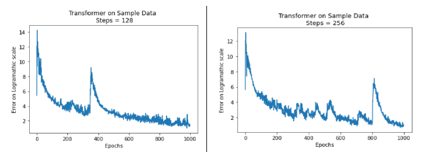

# Transfer Learning Between Atari Games via Transformer Models

Implementation of **OpenAI's Requests for Research 2.0** problem:

> **Transfer Learning Between Different Games via Generative Models**

This project investigates the use of **Transformer-based generative models** for transfer learning across Atari games. The proposed approach combines **Deep Reinforcement Learning (DQN)** for gameplay trajectory generation with a **Transformer implemented from scratch in TensorFlow** to learn sequential representations of game dynamics.

---

## Research Motivation

Transfer learning has shown remarkable success in natural language processing, where large pre-trained models can be fine-tuned for downstream tasks. This project explores whether similar ideas can be applied to **Reinforcement Learning**, enabling knowledge learned from multiple Atari games to accelerate learning on unseen games.

The work follows the research direction proposed in **OpenAI Requests for Research 2.0**.

---

## Research Pipeline

### Stage 1 — Gameplay Data Generation

- Train Deep Q-Network (DQN) agents on Atari games.
- Generate gameplay trajectories consisting of:
  - Environment states
  - Agent actions
  - Rewards
- Build sequential datasets for Transformer training.

---

### Stage 2 — Transformer-Based Sequence Modeling

- Implement the **Attention Is All You Need** architecture from scratch in TensorFlow.
- Adapt the Transformer to learn from Atari gameplay trajectories instead of natural language.
- Train the model to learn transferable representations across multiple games.

---

## Repository Structure

```
.
├── Transformer.ipynb                  # Transformer implementation in TensorFlow
├── OpenAI-Request for Research 2.0.pdf # Research report
└── README.md
```

---

## Technical Highlights

- Deep Reinforcement Learning
- Deep Q-Network (DQN)
- Transformer Architecture
- Attention Mechanism
- TensorFlow
- Sequence Modeling
- Transfer Learning
- Atari Gym Environments

---

## Repository Contents

### Transformer.ipynb

Contains the complete implementation of a customized Transformer architecture, including:

- Positional Encoding
- Multi-Head Attention
- Encoder
- Decoder
- Feed Forward Networks
- Training Pipeline
- Atari trajectory preprocessing

---

### OpenAI-Request for Research 2.0.pdf

Contains the complete research report including:

- Problem Statement
- Literature Review
- Methodology
- System Architecture
- Experimental Results
- Challenges
- Future Work

---

## Results

The project successfully demonstrates:

- Gameplay trajectory generation using Deep Q-Network agents.
- Transformer implementation from scratch using TensorFlow.
- Sequence modeling on Atari gameplay trajectories.
- Adaptation of Transformer architectures beyond traditional NLP applications.
<p align="center">
  
</p>

<p align="center">
<b>Figure 1.</b> Training loss curves on DQN-generated gameplay trajectories, demonstrating convergence of the customized Transformer implementation for trajectory lengths of 128 and 256 steps.
</p>
  Figure 1. Training loss curves on DQN-generated gameplay trajectory data, demonstrating convergence of the customized Transformer implementation for trajectory lengths of 128 and 256 steps.

---

## Future Work

Potential improvements include:

- Larger Transformer models
- CNN-based state embeddings
- Multi-game joint training
- Distributed training
- Scaling experiments on larger GPU clusters

---

## References

- Vaswani et al., **Attention Is All You Need**
- Mnih et al., **Human-level Control through Deep Reinforcement Learning**
- OpenAI **Requests for Research 2.0**
